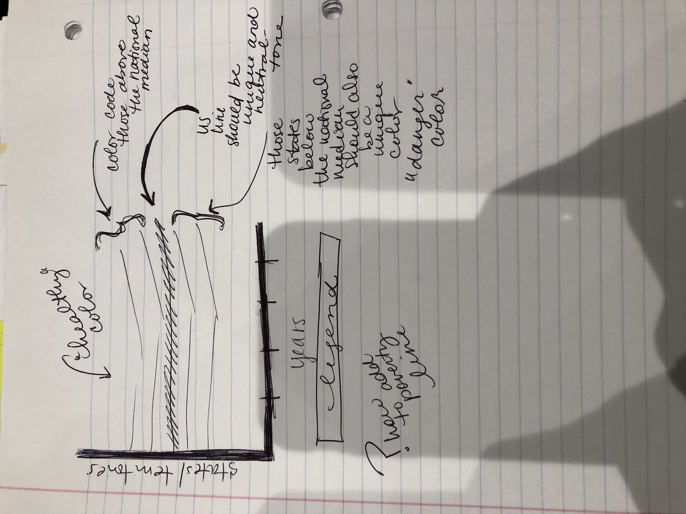
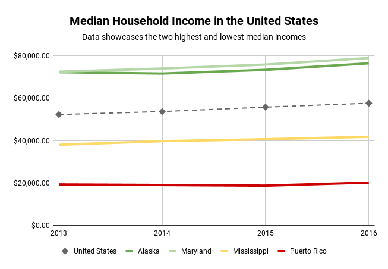

_Step 4: Test the Solution_

**Compilation of Peer Feedback:**
- Can you tell me what you think this is? "Looks like trends over four years for four states and the country. It's a bit simple, but I am curious about it."
- Can you describe to me what this is telling you? "It is showing me that certain states are doing well - even >$20,000 above the median while others are <$20,000 or even further below such as the territory of Puerto Rico. That makes me wonder what's been going on to improve the median household income for those states below the country median."
- Is there anything you find surprising or confusing? "It's really surprising how I have a limited reaction to the data in the original format, but a stronger responses when I can see that the struggles Puerto Rico and Mississippi have with raising the median income didn't change over the four years enough to bring them closer to the national median. I would like to see more data."
- Who do you think is the intended audience for this? "This could be for politicians, voters, and anyone living in these states. Do you have more data for the other states and territories?"
- Is there anything you would change or do differently? "If you could add the other states, that'd be great. Also, stay away from certain color combinations. You had an idea for just a "stop" and "go" color combination of green and red and that immediately looked like Christmas. I like that the United States line is different from the actual specific states and is a neutral color."

The advice about color combinations was helpful because I was getting caught up trying to make a bigger impression with the data I used. The opportunity to have those simple reminders allowed me to see it and improve something that would have made an already simple visualization become muddied.

_Step 5: Build Your Solution_ 
**This chart demonstrates the median household income trends from 2013-2016 in the United States between the two highest and lowest states.**
<iframe width="720px" height="480px" src="https://embed.datausa.io/profile/geo/united-states/economy/income?viz=True" frameborder="0" ></iframe>
[Original data from DataUSA](https://datausa.io/profile/geo/united-states/#income)

The redesign focuses on how important trends over time tell a bigger story when compiled rather than separate. The original was interactive and fun with a serious but boring color palette that didn't create a visual reaction to the discrepencies in the household medians. I wanted to capture the importance of the broad range in medians between the states and territory in order to have the dollar differentiation and stagnation or lack of support or positive change in Mississippi and Puerto Rico's household medians. I also wanted the "success" of Maryland and Alaska to almost float above the national median to spark a gutteral "why?" reaction from the audience which becomes heightened by the new design and color choices. 

I wanted to make the color palette simple and easily relatable. At first I conisdered a two color design but feedback helped me realize that a three-color system and division of those colors based on the approximate $20,000 difference visible between the national median, Mississippi, and Puerto Rico would allow the data to make a bigger statement. While the "traffic light" color combination is not the most inventive color pallette to consider, it is more striking to present the positives and negatives in. I played around with various shades of green but found myself naturally viewing all of the data as positive since all medians were green like money and the western color symbolism that "green is good." Throughout the activity I attempted to incorporate more states but found my skills to be lacking in making that possible at this time. If I could redo the visual I would definitely play around with regions of America and the national median in order to showcase further financial discrepencies across the country. 

The wireframe was relatively easy to design because I knew what part of the data I wanted to transform into the spotlight. It was the color palette that held a bit more of a challenge. The use of a bar line design, while again simplistic, proved opportune with the program I was using. I tried for hours to translate my data into RAWgraph with no positive results, so I focused on creating in Google Sheets. It would have been more appealing in a less traditoinal design, but I maximized the design in simplicity to be as truthful and useful as possible. It made complete sense from the feedback I received from peers to make the national median a neutral color and have a different line style (dashes with diamonds) in order to make it stand out amongst the focal points which were the states in comparison to it. That was a simple fix that made a strong visual impact. Now, I feel like the audience can see not only where these states and territory lie compared to the national househould median, but can also see that "the rich stay rich and the poor stay poor" shows through in the stagnation or limited visible growth or change in Mississippi and Puerto Rico's positive growth compared to the national median and Maryland and Alaska. Feedback proved stronger surprised responses because the timeline trend focus was obvious and clear.

