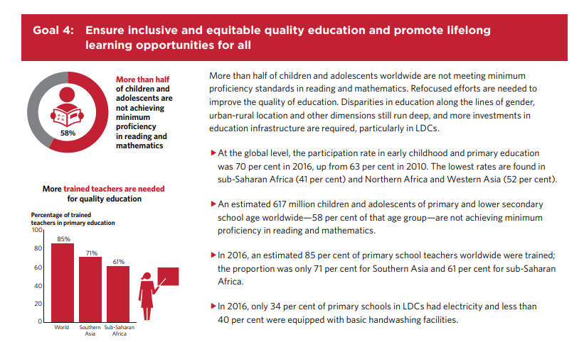

# Final Project, Part 1: Project Overview

**OBJECTIVE**
>"... 2040, where communities in every part of the world are enabling all of their children to have the education, support, and opportunity to shape a better future for themselves and all of us. These communities are inspiring and informing a worldwide movement to achieve this everywhere."

Informed strategic planning is key to success for any organization especially a mission-driven nonprofit such as Teach for All, a nonprofit focused on developing "...a global network of independent organizations united by the core purpose of developing collective leadership to ensure all children have the opportunity to fulfill their potential." With an ambitious [25 year vision](https://teachforall.org/10-year-report) driving the organization's work, it is therefore logical to maintain trajectory while adapting as needed to the global education environment. 

This project will explore ongoing desparities in education across the world to advocate for the mission of [Teach for All](https://teachforall.org/ in order to ‘eliminate gender disparities in education and ensure equal access to all levels of education and vocational training for the vulnerable, including persons with disabilities, indigenous peoples, and children in vulnerable situations’ to advocate. This document will be an internal **Stakeholders** document presented to the executive administration of Teach for All such as [Wendy Koff](https://teachforall.org/wendy-kopp) and the international board of directors as the next 5 or 10 year strategic plan is being developed.  The goal is to provide supportive, concrete logic between the finacial and human assets of Teach for All and where the most need and sustainability is currently possible to expand the organization.

**BACKGROUND**

According to the [2018 United Nations The Sustainable Development Goals Report](https://unstats.un.org/sdgs/report/2018)
>More than half of children and adolescents worldwide are not meeting minimum proficiency standards in reading and mathematics. Refocused efforts are needed to improve the quality of education. Disparities in education along the lines of gender, urban-rural location and other dimensions still run deep, and more investments in education infrastructure are required, particularly in LDCs.

[**Sustainable Development Goal 4 (SDG 4), Target 4.5**](https://sustainabledevelopment.un.org/sdg4)
>In September 2015, at the United Nations Sustainable Development Summit in New York, Member States formally adopted the [2030 Agenda for Sustainable Development](https://sustainabledevelopment.un.org/post2015/transformingourworld). The agenda contains 17 goals, one of which, SDG 4, is to ensure inclusive and equitable quality education and promote lifelong learning opportunities for all. SDG 4 has seven targets and three means of implementation. Target 4.5 focuses on equity and calls upon Member States to eliminate gender disparities in education and ensure equal access to all levels of education and vocational training for the vulnerable, including persons with disabilities, indigenous peoples, and children in vulnerable situations.

**STORY ARC**

1. **Setup:** This is a lead document for a board meeting centered around discussing the status of the organization and the mission's progress. We will review the latest annual report and status of the current 46 partner "chapters" of Teach for All to reflect on where the organization is before discussing the possibile directions to move forward in for the next five or ten years.

2. **Conflict:** The current financial and human assets of Teach for All need to be compared with the ambitions of the organization and board strategy must be discussed.

3. **Resolution:** The class will in essence play the role of the board and have an opportunity within the time allotted for my final presentation slot to share their ideas for which next steps they would like to see such as selecting a few countries and reasoning it out together.

**THE DATA**

The [World Inequality Databse on Education (WIDE)](https://www.education-inequalities.org/about) is the **educational inequalities data** being utilized for this funding proposal. It can be accessed via the link above and clicking on the link labeled "Download Data in CSV Format."
>The World Inequality Database on Education (WIDE) brings together data from Demographic and Health Surveys (DHS), Multiple Indicator Cluster Surveys (MICS), other national household surveys and learning assessments from over 160 countries. Users can compare education outcomes between countries, and between groups within countries, according to factors that are associated with inequality, including wealth, gender, and ethnicity and location. Users can also create maps, charts, infographics and tables from the data, and download, print or share them online.

>The database was first created as the Deprivation and Marginalization in Education (DME) dataset for the 2010 EFA Global Monitoring Report and re-launched as WIDE with interactive online features in 2012. In November 2018, the Global Education Monitoring Report and the UNESCO Institute for Statistics established a partnership to jointly maintain and develop WIDE to support the monitoring of **Sustainable Development Goal (SDG) 4** and in >particular **target 4.5** on equity.

Other data sources will include financial statements from [2014-2016](https://teachforall.org/financials), [2017 990](https://www.guidestar.org/profile/26-2122566),  [indivdual country reports](https://teachforall.org/about#27101) from the 46 countries, and the [SDG 4 Data Book: International Education Indicators 2018](http://uis.unesco.org/en/topic/sustainable-development-goal-4). Extrapolating the range of needs and variables concerning each country from the UNESCO data will help make data-supported strategic choices while also comparing the data within the Teach for All financial reports will provide practical support to understand the costs of opening a new "chapter" and to begin to understand how many over a series of time would be plausible and sustainable.

**METHOD AND MEDIUM**

**Drafting:** This is my favorite part, so I will be doing a moodboard and sketching a variety of possible data visualizations. Visuals can be created for each country, each region, each continent, and the world. An animated visual showing the growth history of Teach for All could be helpful in the introduction. 

**Wireframe:** I will explore designs via Tableau, Rawgraph, and Infogram; share my visuals with peers in the class as well as my former Teach for America peers to seek feedback; and write personal reflections on the visuals. This will probably be a large investment of time.

**Final Presentation:** The intitial plan is to use Infogram or Shorthand for the final presentation.

[Homepage](https://atchavez888.github.io/Nina-Chavez/)

[Final Project, Part 2: Sketches, Wireframes](final_project_part2_NinaChavez)
