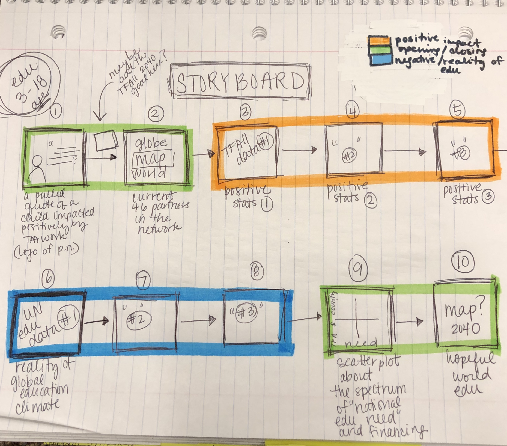
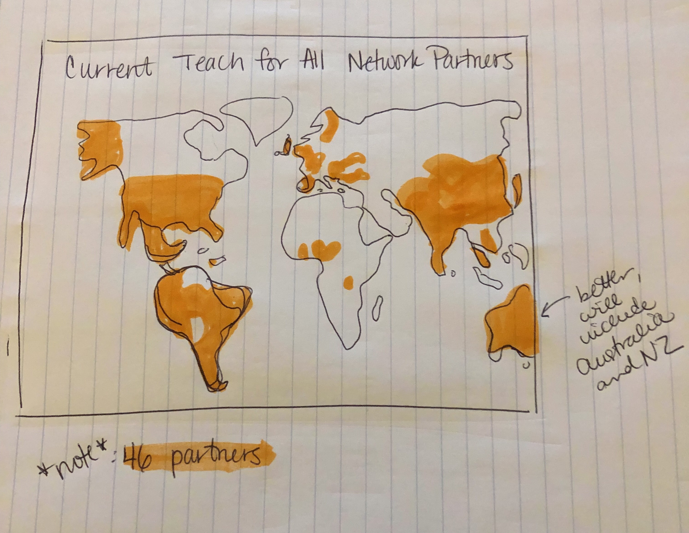
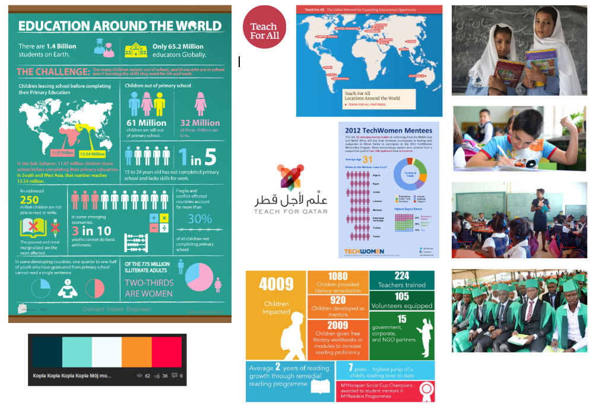

# Final Project, Part II: Sketches, Wireframes, Storyboards

## **SKETCHES & STORYBOARDS**

I struggled to sketch out what core infographics would be useful and clear to support the positive opening to the presentation. I received some useful tips for this point in the presentation from feedback. I'll be collecting more data and dig deepre into what I currently have from Teach for All and other sources to help with this issue. Before viewing the feedback I did manage to sketch out this:

  * **Global Ambassadors:** 2 (1 male, 1 female)

>
>

**2. Approach to identifying representative individuals to interview**

>To select individuals to interview and review the progress of my sketches and wirefream, I wanted to have a pool of candidates connected in one or another to education or public policy as well as individuals not directly working or studying those subjects. I selected two current educators, a former educator now working in marketing and development for a national charter school, peers in the graduate school PPM and MAM programs and an undergraduate at Pitt studying cyber security.

**3. Interview Script**

My interview script is a [Google Form](https://docs.google.com/forms/d/e/1FAIpQLScWbKrKVDqOWSsyX0L4IJTHxHIEFyquYV4r39r4BTgIUkUm1Q/viewform?usp=sf_link) which allowed structure in reviewing the feedback I received to each question. The form itself is accessible below.
<iframe src="https://docs.google.com/forms/d/e/1FAIpQLScWbKrKVDqOWSsyX0L4IJTHxHIEFyquYV4r39r4BTgIUkUm1Q/viewform?embedded=true" width="640" height="441" frameborder="0" marginheight="0" marginwidth="0">Loading...</iframe>

**4. Interview Findings**

From the interviews, I received the [following feedback](https://docs.google.com/spreadsheets/d/1TF5Vdd2Z5u3QCpivBIbNvIBHHfGLx0VaAz0ssSvRSZ4/edit?usp=sharing).

**5. Changes Implemented**
  
  * **Storyboard**
    * Clear. Overall received accurate responses to the storyboard.
  
  * **Current Teach for All Network: Clarity** 
    * For this map, I realized that many viewers wanted to know the names of the countries already a part of the network. They also suggested improving the title to include something such as "as of 2019." 
    
    * I originally began Wireframing in Datawrapper but found that Infogram's setup for mapping allowed me to add in an interactive means to display: each country's name, year the partnership was established and the actual name of the chapter. That should clarify a bit more historical and name recognition for the audience especially if they interact with my Shorthand website for the final.
  
  * **Positive Impacts of TFA as of 2019:**
    * I needed a lot of help designing this cluster of infographics. Overall, though, it seems like I should sit down with Max, the TA, and flesh this out this week.
  
**RESPONSES INCLUDED:**
 
>* "School attendance rates over time since joining"
     * "Numbers of schools involved or touched by Teach for All"
     * "I think a graphic showing an increasing number of children completing high school or its equivalent abroad would be helpful or maybe a graphic showing the increase in country GDP since TFAll started an operation in that country. It could show the impact education has on the economy of the country."
  
  * **Disparities**:
   * I needed some help with this cluster of infographics but not so much because I was more comfortable extracting some data from the sets I currently have. Viewers did understand the goals I had. Overall, though, it seems like I should sit down with Max, the TA, and flesh this out this week.
   
**RESPONSES INCLUDED:**  

>  * "Improve title"
   * "For location, include a map."
   * "Develop this idea that actually integrates the disparities. They seem very disconnected especially for someone not familiar."
   * "Pictograms"
  
  * **Scatterplot**
    * There was strong clarity in understanding this visual and positive responses overall.
    * I will overlay a map to correspond with the dots. I also would like to figure out how to make the map and scatterplot interactive so as a viewer reviews it, they can gain additional information such as the country's name and maybe the current population that should be in school for a specific age range. I should improve the title - perhaps something along the lines of "Looking Forward, Potential Partners 2020-2030"
    
**RESPONSES INCLUDED**

>  * "Clarify Y-axis"
   * "Color-code will be key."
   * "This will be a strong visual, so clarity overall will be very necessary."
  
## **WIREFRAMES**  

<a href="https://infogram.com/4c482b38-c962-4a27-b748-7c08604e904b" style="color:#989898!important;text-decoration:none!important;" target="_blank">Teach for All  Network Partners</a> <a href="https://infogram.com" style="color:#989898!important;text-decoration:none!important;" target="_blank" rel="nofollow">Infogram</a>

## **MOODBOARD**

