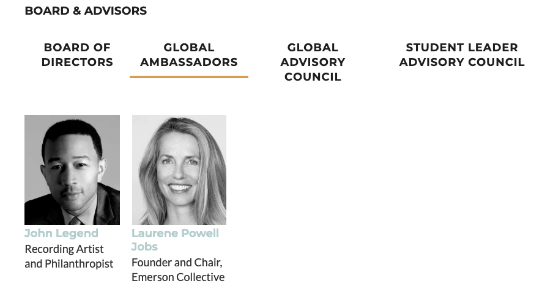

# Final Project, Part II: Sketches, Wireframes, Storyboards

**SKETCHES & STORYBOARDS**

**USER RESEARCH PROTOCOL**

**1. Target Audience**

>The target audience for this presentation will be the Teach for All Board of Directors and Global Ambassadors as they plan the next 10-year strategic plan for the organization. They lead the decision making process of the organization, have the clout and relationships to tackle and begin selecting and engaging the next potential national chapters of the Teach for All network. They led the decisions in selecting and developing the current 46 chapters Teach for All and will continue that mission using the data from this presentation. 

  * **Board Members:** 18 (13 males, 5 females)
  * **Global Ambassadors:** 2 (1 male, 1 female)

>
>

**2. Approach to identifying representative individuals to interview**

>To select individuals to interview and review the progress of my sketches and wirefream, I wanted to have a pool of candidates connected in one or another to education or public policy as well as individuals not directly working or studying those subjects. I selected two current educators, a former educator now working in marketing and development for a national charter school, peers in the graduate school PPM and MAM programs and an undergraduate at Pitt studying cyber security.

**3. Interview Script**

My interview script is a Google Form which allowed structure in reviewing the feedback I received to each question. The form itself is accessible below.
<iframe src="https://docs.google.com/forms/d/e/1FAIpQLScWbKrKVDqOWSsyX0L4IJTHxHIEFyquYV4r39r4BTgIUkUm1Q/viewform?embedded=true" width="640" height="441" frameborder="0" marginheight="0" marginwidth="0">Loading...</iframe>

**4. Interview Findings**

From the interviews, I received the [following feedback](https://docs.google.com/spreadsheets/d/1TF5Vdd2Z5u3QCpivBIbNvIBHHfGLx0VaAz0ssSvRSZ4/edit?usp=sharing).

**5. Changes Implemented**
  
  * Issue A: **NEED**
  
  * Issue B: 
  
  * Issue C:
  
**WIREFRAMES**  
[Shorthand](www.asdlfjasdl;kfjasld;kfcom)

**MOODBOARD**
